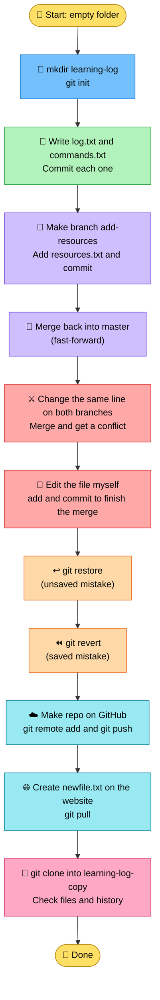
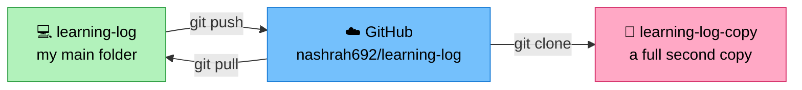
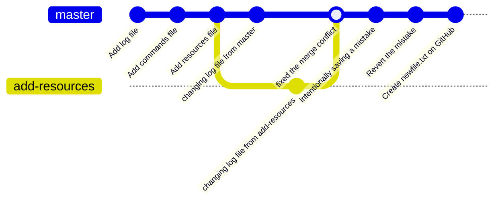
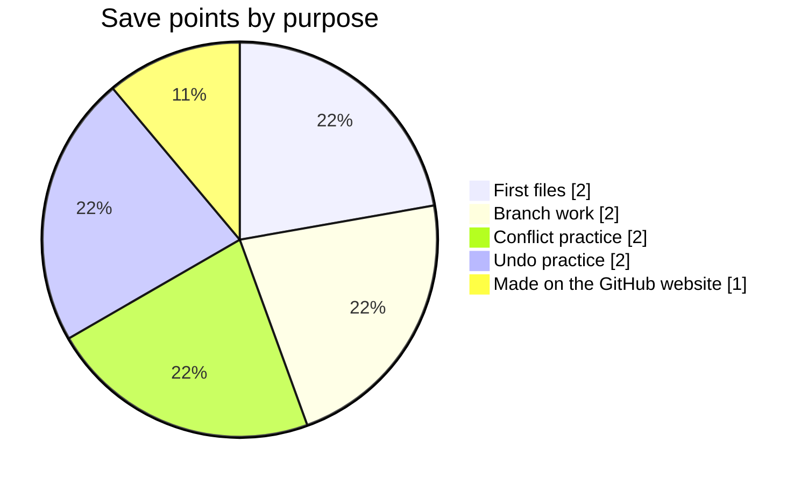
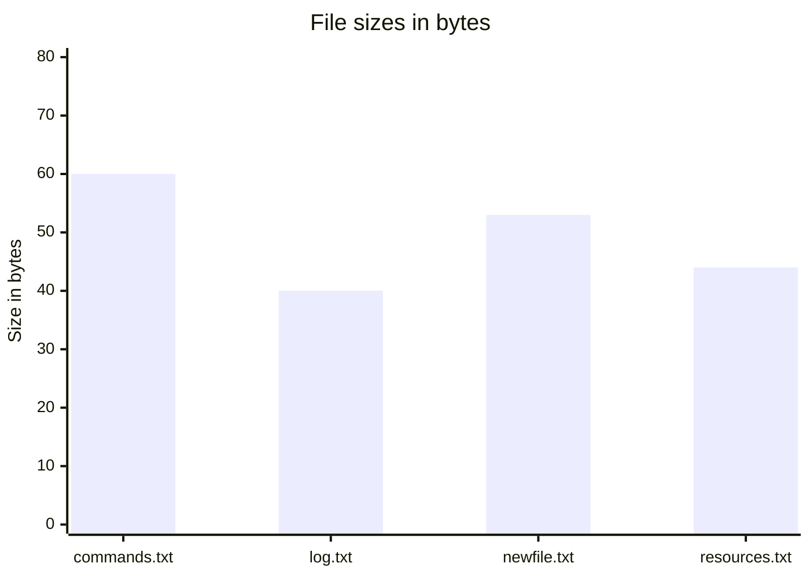

<div align="center">

# 📒 learning-log

**My first only Git project: a tiny log of four text files, built to practice every basic Git skill in one go.**


</div>

---

## 📌 At a Glance

| | |
|---|---|
| 🏷️ **Project** | learning-log |
| 📝 **What it is** | A practice repo with four small text files and a very deliberate history |
| 🎯 **Why I made it** | The big project at the end of Part 1 (Terminal and Git basics) of my learning roadmap |
| 💻 **Where I built it** | The terminal on my Windows 11 laptop, with Git 2.52.0 |
| 💾 **Save points (commits)** | 9 |
| 🌿 **Branches** | 2 (`master` and `add-resources`) |
| ⚔️ **Conflicts solved** | 1, caused on purpose |
| 📅 **Built on** | 3 October 2026 |

---

## 🗣️ In Simple Words

Think of a notebook where, every time you finish a page, you take a photo of the whole notebook and write a short label on it. If you ruin a page later, you can look through the old photos and bring the good version back. Git does exactly this for files.

This repo is my practice notebook. The files inside are tiny and the sentences in them are a bit silly, and that is on purpose. The files were never the point. The point is the history behind them: the save points, the branch I made and merged, the fight between two versions of the same line that I had to settle, the mistakes I made and then undid, and the trip to GitHub and back.

If you open the commit history of this repo, you are reading me learning Git, one save point at a time.

---

## 💡 Why I Made This

I studied AI at university, and now I want to build real things: AI tools, automations and full products. Every one of those projects will live on GitHub. The problem was that I only knew GitHub through its website, and I was shaky with Git commands in the terminal.

So I started my roadmap with Git, because everything else I want to learn sits on top of it. I followed a step by step course where I did every command myself on my own computer. This repo is the project at the end of that first part. Instead of copying one command at a time, I had to use everything together, without anyone spelling out each line for me.

---

## ✅ What I Did

I had nine goals for this project. Here is each one, with the main commands I used.

| # | Goal | What I did | Main commands |
|---|---|---|---|
| 1 | Start the project | Made a new folder outside my practice folders and told Git to start tracking it | `mkdir`, `cd`, `git init` |
| 2 | Write the first files | Made `log.txt`, `commands.txt` and later `resources.txt` | `echo ... > file` |
| 3 | Make save points | Saved my work in clear steps, each with a label that says what it holds | `git add`, `git commit -m` |
| 4 | Use a branch | Made `add-resources`, added a file there, then merged it back into `master` | `git switch -c`, `git merge` |
| 5 | Cause and solve a conflict | Changed the same line of `log.txt` on two branches, merged, and chose the final sentence | `git merge`, then edit, `git add`, `git commit` |
| 6 | Practice both undos | Threw away an unsaved mistake, and cancelled a saved one | `git restore`, `git revert` |
| 7 | Send it to GitHub | Made an empty repo on the website, connected it, and uploaded my save points | `git remote add`, `git push -u` |
| 8 | Check the round trip | Made a file on the GitHub website, then brought it back to my computer | `git pull` |
| 9 | Clone it | Made a full second copy from GitHub and checked the files and the history | `git clone`, `git log --oneline` |

---

## 🛠️ How I Did It

Here is the real order of commands I typed, with a short note on what each group did.

**1. Start the project and make the first two files**

```bash
mkdir learning-log
cd learning-log
echo in part 1 i learned about basic git commands > log.txt
echo i now know several commands for adding/deleting/push/pull > commands.txt
git init
git add log.txt
git commit -m "Add log file"
git add commands.txt
git commit -m "Add commands file"
```

I made the folder, wrote two small files, told Git to start watching the folder, and saved each file as its own save point.

**2. Make a branch and bring its work back**

```bash
git switch -c add-resources
echo i plan to study the topics n8n, llms, etc >resources.txt
git add resources.txt
git commit -m "Add resources file"
git switch master
git merge add-resources
```

I made a separate line of work called `add-resources`, saved a new file there, went back to the main line, and pulled the new file in.

**3. Cause a conflict on purpose, then fix it**

```bash
echo changing log file from master > log.txt
git add log.txt
git commit -m "changing log file from master"
git switch add-resources
echo changing log file from add-resources > log.txt
git add log.txt
git commit -m "changing log file from add-resources"
git switch master
git merge add-resources
```

I rewrote the same file in two different ways, one on each branch. When I tried to merge them, Git stopped and showed me both versions inside the file:

```text
<<<<<<< HEAD
changing log file from master
=======
changing log file from add-resources
>>>>>>> add-resources
```

Git cannot pick a winner when two branches disagree about the same line, so it asks the human. I decided what the line should say, replaced the whole messy block with my choice, and sealed it:

```bash
echo fixing the merge conflict from master > log.txt
git add log.txt
git commit -m "fixed the merge conflict"
```

**4. Make two mistakes and undo them**

```bash
echo oh no i'm gonna make a mistake aaaa > log.txt
git restore log.txt

echo i am making mistake and saving it this time hehe > log.txt
git add log.txt
git commit -m "intentionally saving a mistake"
git revert HEAD --no-edit
```

The first mistake was never saved, so `git restore` simply brought back the last saved version. The second mistake was already saved, so I could not erase it. `git revert` added a new save point that cancels it out instead.

**5. Send it to GitHub**

I made an empty repo on the GitHub website with nothing ticked, then connected my folder to it and uploaded:

```bash
git remote add origin https://github.com/nashrah692/learning-log.git
git push -u origin master
```

**6. Edit on the website and pull the change home**

On the GitHub website I created a file called `newfile.txt`. Then, back in the terminal:

```bash
git pull
```

The new file showed up in my folder.

**7. Clone it and check**

```bash
cd ..
mkdir learning-log-copy
cd learning-log-copy
git clone https://github.com/nashrah692/learning-log.git
git log --oneline
```

The copy had all four files and all nine save points, so the clone is a complete second copy of the project.

---

## 🗺️ Workflow Diagram



### 💻 Where the project lives



### 🌿 How the history branches

This picture starts at the point where the conflict happens. My first merge was a fast-forward, which means `master` simply moved up to catch the branch, so it did not add a save point of its own.



---

## 📜 The Full History

These are all nine save points, from oldest to newest.

| # | ID | Label | What it was for |
|---|---|---|---|
| 1 | `b297c99` | Add log file | First file, first save point |
| 2 | `89e53b0` | Add commands file | Second file |
| 3 | `645ac7a` | Add resources file | Made on the `add-resources` branch, then merged in |
| 4 | `912b31a` | changing log file from master | Setting up the conflict, `master` side |
| 5 | `79612ba` | changing log file from add-resources | Setting up the conflict, branch side |
| 6 | `8e980d3` | fixed the merge conflict | Where I chose the final sentence |
| 7 | `2bc0fd1` | intentionally saving a mistake | A saved mistake, made on purpose |
| 8 | `9856a5c` | Revert "intentionally saving a mistake" | The undo for save point 7 |
| 9 | `a31a4bf` | Create newfile.txt | Made on the GitHub website, not in my terminal |

---

## 📊 Graphs

### What each save point was for



### Size of each file



All four files together are only 197 bytes. Each file is a few bytes bigger than its sentence, because the terminal adds a space and a line break when you use `echo` with `>`.

---

## 🔧 Technical Explanation

This repo is a plain Git repository with no code in it. It only holds text files, so everything interesting is in the history and the way it was built. Here is what each Git idea means and where it shows up in this project.

| Idea | In plain words | Where it shows up here |
|---|---|---|
| **Repository (repo)** | A folder that Git is tracking, together with its whole history | `learning-log` after `git init` |
| **Commit** | A save point with a label | All 9 entries in the history above |
| **Staging (`git add`)** | Choosing which changes go into the next save point | Before every commit I made |
| **Branch** | A separate line of save points where I can experiment safely | `add-resources` |
| **Merge** | Bringing the work of one branch into another | `add-resources` into `master`, twice |
| **Fast-forward** | A merge where the receiving branch just moves up, with no extra save point | The first merge |
| **Merge conflict** | Two branches changed the same part of a file, so Git asks me to decide | `log.txt` |
| **`git restore`** | Throws away unsaved changes and brings back the last saved version | The first mistake in `log.txt` |
| **`git revert`** | Adds a new save point that cancels an older one, without rewriting history | `intentionally saving a mistake` |
| **Remote (`origin`)** | A copy of the project stored somewhere else, here on GitHub | `git remote add origin ...` |
| **Push** | Uploads my save points to the remote | `git push -u origin master` |
| **Pull** | Downloads new save points from the remote | Bringing in `newfile.txt` |
| **Clone** | Makes a full copy of a remote repo, with its history | `learning-log-copy` |

**A few details worth knowing**

- The `-u` in `git push -u origin master` tells Git to remember the link between my `master` and GitHub's `master`, so later I can type just `git push` or `git pull`.
- `git restore` cannot be undone, because the changes it throws away were never saved. `git revert` is the safe one for saved work, because the old save point stays in the history.
- The clone ended up one folder deeper than I planned, at `learning-log-copy\learning-log`, because I made the `learning-log-copy` folder first and then cloned inside it. It still worked and all four files and nine save points came across.
- Only `master` was pushed to GitHub. The `add-resources` branch still lives only on my computer, so a fresh clone shows `master` only.

---

## 🤔 What Went Wrong (and How I Fixed It)

| Moment | What happened | What I did |
|---|---|---|
| I typed `got` instead of `git` | The terminal said it did not recognize the command, and nothing changed | Retyped it correctly |
| I overwrote `log.txt` by mistake | Git showed the file as modified, but the change was not saved | Ran `git restore log.txt` and the old sentence came back |
| I saved a mistake into the history | It was already a save point, so I could not just delete it | Ran `git revert HEAD --no-edit` to cancel it |
| Two branches changed the same line | The merge stopped with a conflict | Edited the file by hand, then ran `git add` and `git commit` |
| I cloned inside a folder I had already made | The project landed in a nested folder | Left it as is, since it still worked |

---

## 📦 Requirements

| Need | Details |
|---|---|
| 💻 A terminal | I used the terminal on Windows 11 |
| 🔧 Git | I used version 2.52.0 |
| 🐙 A GitHub account | To make the repo and push to it |

There is nothing to install besides Git, and no packages or build steps.

## 🚀 How to Get It

To get your own copy of this project:

```bash
git clone https://github.com/nashrah692/learning-log.git
cd learning-log
```

Then you can open the files, or run `git log --oneline` to read the history.

## 📁 Project Structure

```
learning-log
├── README.md       What you are reading
├── commands.txt    Commands I now know
├── log.txt         What I learned in Part 1
├── newfile.txt     Made on the GitHub website
└── resources.txt   Topics I plan to study next
```

## 🧰 Built With

| Tool | Used for |
|---|---|
| Git | Keeping the save points and history |
| GitHub | Storing the project online |
| The Windows 11 terminal | Typing every command |

---

## 🌱 What I Learned

- A terminal is just a way of giving the computer instructions by typing, and it is faster than it looks.
- Git is a set of save points, and the habit that matters most is saving often, with labels that say what changed.
- A branch is a safe place to try things, and a merge conflict is only Git asking me which version I want.
- `git restore` and `git revert` are two different undo tools, and which one to use depends on whether the mistake was saved yet.
- Pushing, pulling and cloning are three ways of moving work between my computer and GitHub.

## 🔜 What Is Not Here Yet

- A `.gitignore` file
- Pushing my other branches to GitHub
- Logging in with SSH instead of the browser sign-in
- Real notes in the log, since the current sentences are only practice

My next step in the roadmap is Part 2, working with APIs and JSON in Python.

---

## 👩‍💻 Author

Built by **Nashrah Ahmed Khan** as the Part 1 project of my learning roadmap.

GitHub: [@nashrah692](https://github.com/nashrah692)
